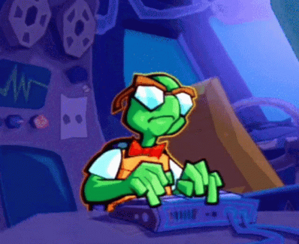

### Hi there 👋

My name is Mohammed Ahmed, but you can call me Mo!

<h2> About Me: </h2>
#####I am a Developer who loves to learn about interesting technologies. 
I mostly worked on projects that relate to old Video Game Consoles/Emulators. I will be uploading some of my old projects that I worked on for the PlayStation 2 and Nintendo GameCube/Wii.

- 🔭 I’m currently working on ...

    - Drawing 3D objects using the PlayStation's Vector Units
    - Updating my Memory Card Manager for the GameCube to support Wii files
    - Port my Discord-PCSX2 Integration to the latest branch

- 🌱 I’m currently learning ...
    - Apache Spark
    - OpenGL Development
    - Embedded Python
- ⚡ Fun facts about myself: ...

    - My first language that I learnt was C03/C99
    - I know some PowerPC Assembly

<!--
**Metropass/Metropass** is a ✨ _special_ ✨ repository because its `README.md` (this file) appears on your GitHub profile.

Here are some ideas to get you started:

- 🔭 I’m currently working on ...
- 🌱 I’m currently learning ...
- 👯 I’m looking to collaborate on ...
- 🤔 I’m looking for help with ...
- 💬 Ask me about ...
- 📫 How to reach me: ...
- 😄 Pronouns: ...
- ⚡ Fun fact: ...
-->
